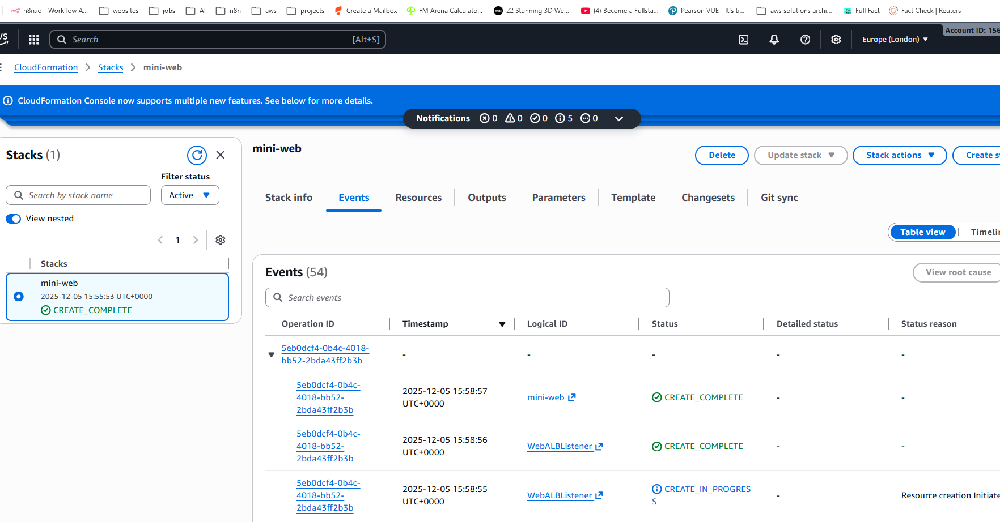
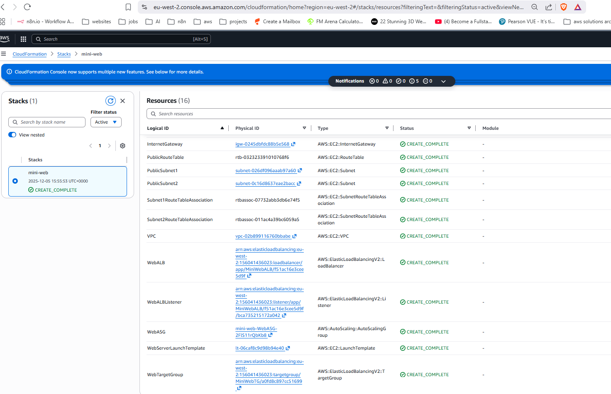
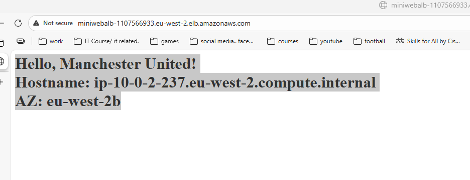
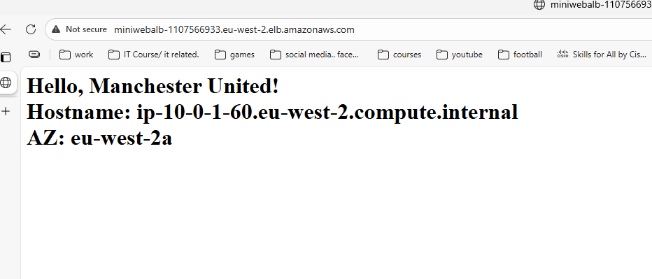

# Mini Web App – CloudFormation Demo

This project demonstrates a **full AWS infrastructure deployment** using **CloudFormation**, including **VPC, ALB, Auto Scaling, and EC2 instances**. The demo also features a Manchester United-themed web page running on multiple EC2 instances across 2 Availability Zones.

---

## Features

- **Fully automated infrastructure** with CloudFormation
- **VPC + 2 Public Subnets** for multi-AZ deployment
- **Application Load Balancer (ALB)** with a Target Group
- **Auto Scaling Group (ASG)** with 2–3 EC2 instances
- **UserData scripts** printing hostname and Availability Zone
- **Manchester United themed demo** showing dynamic content per instance

---

## Screenshots

### 1️⃣ CloudFormation Stack Created


### 2️⃣ CloudFormation Resources


### 3️⃣ ALB Example – First Instance


### 4️⃣ ALB Example – Second Instance


> Refreshing the ALB URL shows traffic being distributed across multiple EC2 instances.

[Watch ALB Demo Video](alb.mp4)

## How to Deploy

1. Ensure you have an **AWS Key Pair** (e.g., `miniweb-key`) and AWS CLI configured.
2. Clone this repo:

```bash
git clone https://github.com/Jazblue/Miniwebapp.git
cd Miniwebapp
